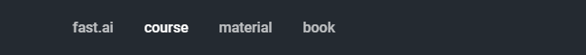

# FEEDBACK & CORRECTION - WHAT TO FOCUS ON

Since the format may not be entirely clear, here I clarify what exactly **is** and **is not** part of my reference document, and what I would like the reader to focus on.

## Content I've not written


The following are NOT part of the content I've written


These four links at the top of the page link are meant as a convenience for users, but are **not** part of my writing. The first one links to the homepage of the fast.ai website \(essentially a blog\), which is where the 3D printed mask article was. The second one links to the fast.ai Machine Learning Massive Open Online Course \(MOOC\), the third one to the technical material and the fourth one to the not-yet-released book.

## Content I have written


The following is content I have created


Everything under the www.fastaireference.com domain. Sometimes you'll find links like [this](https://www.wikipedia.org/) that may lead to Wikipedia or other resources. These may lead to other [domains](https://en.wikipedia.org/wiki/Domain_name), like Wikipedia. If the [URL ](https://en.wikipedia.org/wiki/URL)of the website changes \(the sequence of words you see at the top of the browser\), then the content is not written by me,

