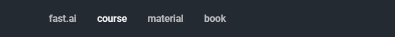

# Overfitting and Underfitting

Overfitting \(and Underfitting\) is one of the central problems of Machine Learning. Essentially, Machine Learning is the learning of a function that maps a set of inputs to an optimal set of outputs. 

In the example below, a function is desired that approximates the training data \(the visible set of points\) and that would predict as accurately as possible a new datapoint. 

**Underfitting:** if a too-simple function is chosen \(i.e. a linear function\) then our line does not adequately approximate the distribution of points. We are underfitting.

**Optimal fit:** ideally, a _just-complex-enough_ function is chosen to fit the dataset. In this case, a third order polynomial function is enough to adequately describe the curve that the datapoints are in. If a new datapoint was added, it would lay relatively close to our curve.

**Overfitting:** if an overly complex function is chosen \(i.e. a 20th order polynomial function\) then we can fit ALL the training data _perfectly._ All the points lay on the curve. However, were a new datapoint added, this model would badly err on predicting its position.

Another example of over/under fitting:

## How do we solve this?

If a model is underfitting the solution is simple: increasing the number of parameters \(layers, nodes, etc...\).

Overfitting is a slightly more complex issue to deal with. Reducing the number of parameters works, but oftentimes also brings total accuracy down. An alternative is implementing [Dropout](dropout.md). 

